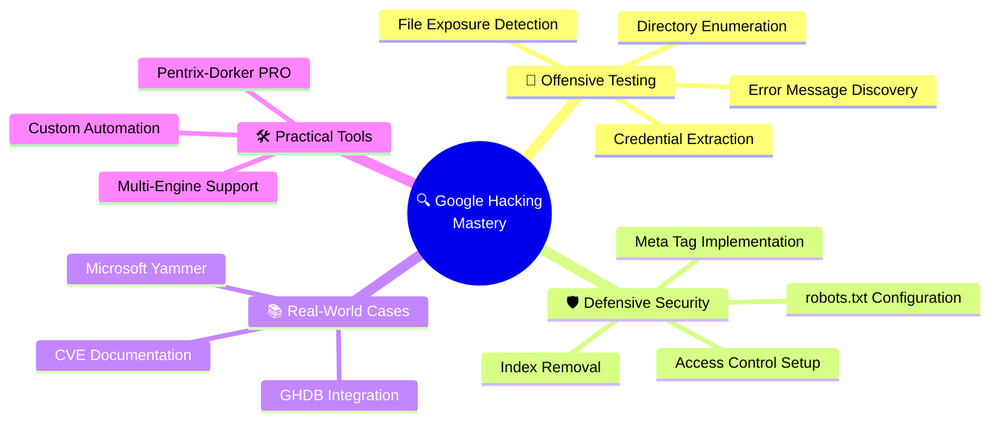
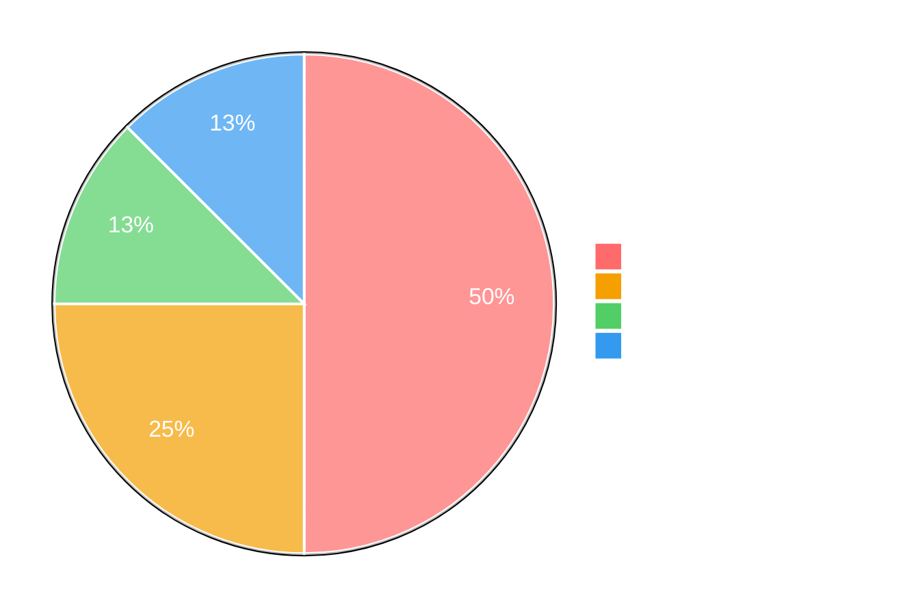
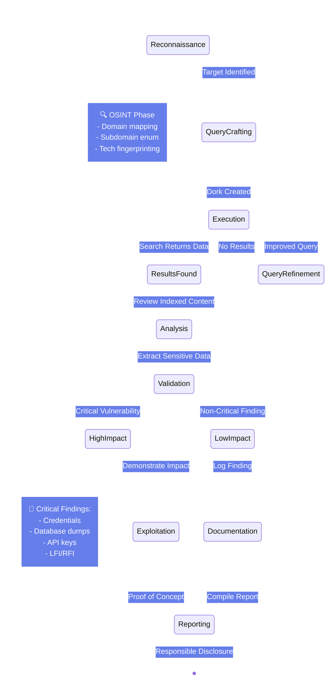
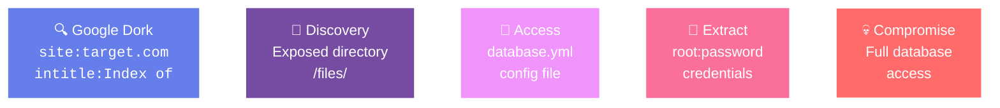
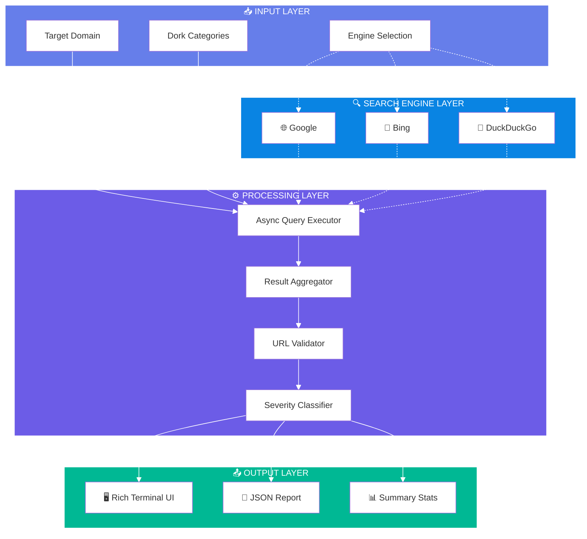
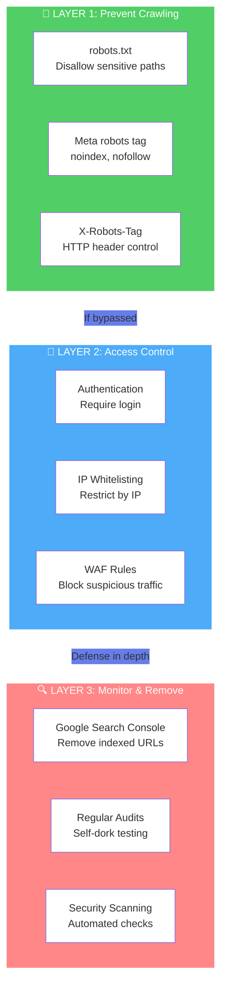
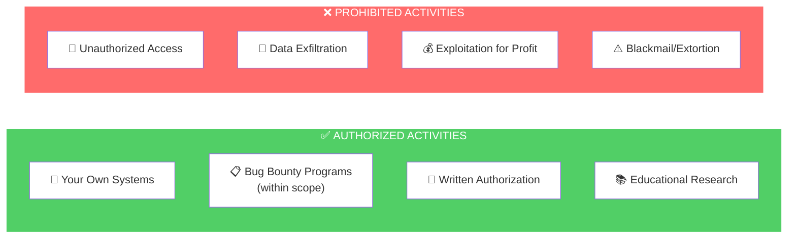

# 🔍 Web Application Security Testing with Google Hacking

<div align="center">

[](LICENSE)
[](https://www.eccouncil.org/)
[](https://github.com/yourusername)
[](#-writeups)

**A comprehensive collection of penetration testing writeups demonstrating Google Dorking techniques for web application security testing.**

[Overview](#-overview) •
[Writeups](#-writeups) •
[Attack Flow](#-attack-methodology) •
[Defense](#-defense-strategy) •
[Resources](#-resources)

</div>

---

## 🎯 Overview

**Google Dorking** (also known as Google Hacking) is a powerful OSINT reconnaissance technique that leverages advanced search operators to discover security vulnerabilities and exposed data across the internet.

### 💡 What This Repository Covers

- **8 Comprehensive Writeups** documenting real vulnerability discovery scenarios
- **Offensive Techniques** for penetration testing and bug bounty hunting  
- **Defensive Strategies** to protect your applications from Google Dorking
- **Practical Examples** with step-by-step exploitation methodology
- **Remediation Guidance** for each vulnerability type

---

### 💡 Repository Highlights



---

## 📊 Vulnerability Severity Breakdown



---

## 📚 Complete Writeup Collection

### 🎯 Detailed Security Assessment Documentation

<table>
<thead>
<tr>
<th align="center">№</th>
<th>📄 Writeup Title</th>
<th>🔍 Vulnerability Type</th>
<th align="center">📊 CVSS</th>
<th align="center">⚠️ Severity</th>
</tr>
</thead>
<tbody>
<tr>
<td align="center"><b>1</b></td>
<td><a href="1.Penetration%20Testing%20Writeup%20Google%20Dorking%20for%20Directory%20Listing%20Enumeration.md">🗂️ Directory Listing Enumeration</a></td>
<td>Information Disclosure via Directory Browsing</td>
<td align="center"><b>7.5</b></td>
<td align="center">🔴 <b>HIGH</b></td>
</tr>
<tr>
<td align="center"><b>2</b></td>
<td><a href="2.Penetration%20Testing%20Writeup%20Google%20Dorking%20for%20SQL%20Error%20Message%20Information%20Disclosure.md">💾 SQL Error Message Disclosure</a></td>
<td>Database Credential Exposure in Stack Traces</td>
<td align="center"><b>9.8</b></td>
<td align="center">🔴 <b>CRITICAL</b></td>
</tr>
<tr>
<td align="center"><b>3</b></td>
<td><a href="3.Penetration%20Testing%20Writeup%20Google%20Dorking%20for%20Publicly%20Exposed%20Backup%20Files.md">📦 Publicly Exposed Backup Files</a></td>
<td>Database Dump with Password Hashes</td>
<td align="center"><b>9.1</b></td>
<td align="center">🔴 <b>CRITICAL</b></td>
</tr>
<tr>
<td align="center"><b>4</b></td>
<td><a href="4.Penetration%20Testing%20Writeup%20Google%20Dorking%20for%20Internal%20Server%20Errors%20%26%20LFI%20Exploitation.md">⚠️ Internal Server Errors & LFI</a></td>
<td>Local File Inclusion + Credential Access</td>
<td align="center"><b>9.8</b></td>
<td align="center">🔴 <b>CRITICAL</b></td>
</tr>
<tr>
<td align="center"><b>5</b></td>
<td><a href="5.Penetration%20Testing%20Writeup%20Google%20Dorking%20for%20Sensitive%20Data%20in%20URLs%20-%20API%20Key%20Exposure.md">🔑 API Key Exposure in URLs</a></td>
<td>Authentication Bypass via Exposed Tokens</td>
<td align="center"><b>9.1</b></td>
<td align="center">🔴 <b>CRITICAL</b></td>
</tr>
<tr>
<td align="center"><b>6</b></td>
<td><a href="6.Penetration%20Testing%20Writeup%20Google%20Dorking%20for%20Insecure%20HTTP%20Web%20Pages.md">🔓 Insecure HTTP Web Pages</a></td>
<td>Man-in-the-Middle via Unencrypted Forms</td>
<td align="center"><b>7.4</b></td>
<td align="center">🟠 <b>HIGH</b></td>
</tr>
<tr>
<td align="center"><b>7</b></td>
<td><a href="7.Google%20Hacking%20Database%20%28GHDB%29%20%26%20Real-World%20Case%20Study%20Microsoft%20Yammer%20Authentication%20Bypass.md">📚 GHDB & Microsoft Yammer Case Study</a></td>
<td>OAuth Token Exposure (Real-World CVE)</td>
<td align="center"><b>9.1</b></td>
<td align="center">📖 <b>CASE STUDY</b></td>
</tr>
<tr>
<td align="center"><b>8</b></td>
<td><a href="8.Defensive%20Security%20How%20to%20Prevent%20Google%20Indexing%20and%20Protect%20Against%20Google%20Dorking.md">🛡️ Defensive Security Guide</a></td>
<td>Prevention, Mitigation & Remediation</td>
<td align="center"><b>N/A</b></td>
<td align="center">🟢 <b>DEFENSE</b></td>
</tr>
</tbody>
</table>

---


## 🎬 Attack Methodology Visualization

### 📍 Complete Google Dorking Kill Chain




### 🔗 Typical Exploitation Chain



---

## 🔑 Google Dork Operators

### Essential Search Operators

| Operator | Function | Example | What It Finds |
|----------|----------|---------|---------------|
| `site:` | Limit to specific domain | `site:example.com` | Only results from example.com |
| `intitle:` | Search in page title | `intitle:"Index of"` | Pages with "Index of" in title |
| `inurl:` | Search in URL path | `inurl:admin` | URLs containing "admin" |
| `filetype:` | Search by file extension | `filetype:sql` | SQL database files |
| `intext:` | Search in page body | `intext:password` | Pages containing "password" |
| `-` | Exclude term | `-inurl:https` | Exclude HTTPS URLs |
| `OR` | Either condition | `ext:bak OR ext:old` | Backup OR old files |

### 🎯 High-Impact Dork Patterns

```
📁 Directory Listings
   site:target.com intitle:"Index of"

💾 Database Backups  
   site:target.com ext:sql "INSERT INTO"

⚙️ Configuration Files
   site:target.com (ext:env OR ext:yml OR ext:config)

🐛 SQL Error Messages
   site:target.com "SQL syntax" OR "mysql_fetch"

🔑 API Keys
   site:target.com (inurl:apikey OR inurl:api_key OR inurl:token)

📋 Backup Files
   site:target.com (ext:bak OR ext:backup OR ext:old)

🔓 Insecure HTTP
   site:target.com -inurl:https intext:password
```

---

---

## 🛠️ Pentrix-Dorker PRO

> 🚀 **Status**: Tool being prepared in separate repository  
> 🔗 **Link**: *Will be added once repository is published*

### Architecture Overview



### ✨ Key Features

- ⚡ **Multi-Engine**: Parallel searches across Google, Bing, DuckDuckGo
- 🥷 **Stealth Mode**: Randomized delays, user-agent rotation, anti-detection
- 📊 **100+ Dorks**: Pre-built security-focused query library
- 🔄 **Async Architecture**: Non-blocking I/O with `asyncio`
- 📈 **Professional Reports**: JSON export with CVSS scoring

---

## 🛡️ Defense Strategy

### Layered Security Approach
<div align="center">


</div>

### Quick Defense Checklist

- [ ] **robots.txt configured** - Block crawling of sensitive directories
- [ ] **noindex meta tags** - Prevent search engine indexing
- [ ] **Authentication enabled** - Require login for sensitive areas
- [ ] **IP whitelisting** - Restrict admin areas by IP
- [ ] **Regular self-dorking** - Test your own site monthly
- [ ] **Google Search Console** - Monitor and remove indexed URLs
- [ ] **File permissions** - Restrict access to config files
- [ ] **HTTPS enforced** - Redirect all HTTP to HTTPS

---


## 📚 Essential Resources

### 📖 Core References

| Resource | Description | Link |
|----------|-------------|------|
| **Google Hacking Database** | 5000+ curated dorks, categorized | [🔗 Exploit-DB GHDB](https://www.exploit-db.com/google-hacking-database) |
| **Johnny Long's Guide** | 170-page Black Hat presentation (2005) | [📄 PDF Download](https://www.blackhat.com/presentations/bh-europe-05/BH_EU_05-Long.pdf) |
| **OWASP Testing Guide** | Web security testing methodology | [📖 OWASP WSTG](https://owasp.org/www-project-web-security-testing-guide/) |
| **Google Search Operators** | Official operator documentation | [🔗 Google Support](https://support.google.com/websearch/answer/2466433) |

### 🛠️ Complementary Tools

| Tool | Purpose | Repository |
|------|---------|------------|
| **Amass** | In-depth subdomain enumeration | [GitHub](https://github.com/owasp-amass/amass) |
| **theHarvester** | OSINT data gathering | [GitHub](https://github.com/laramies/theHarvester) |
| **Pagodo** | Automated GHDB scanning | [GitHub](https://github.com/opsdisk/pagodo) |
| **DorkScout** | Google Dork scanner | [GitHub](https://github.com/enenumxela/dorkscout) |
| **GHunt** | Google account OSINT | [GitHub](https://github.com/mxrch/GHunt) |

---

## ⚖️ Legal & Ethical Framework

### 📜 Authorized vs Prohibited Activities



### ⚠️ Legal Notice

> **CRITICAL REMINDER**: Unauthorized access to computer systems is a **federal crime** under:
>
> - 🇺🇸 **Computer Fraud and Abuse Act (CFAA)** - Up to 20 years imprisonment
> - 🇪🇺 **EU Cybersecurity Act** - Severe penalties and fines
> - 🌍 **International laws** vary by jurisdiction
>
> **Always obtain explicit written authorization before conducting security testing.**

---

## 🎓 Course Information

### EC-Council Web Application Security Testing with Google Hacking

This repository documents practical exercises from:

📘 **Course**: EC-Council Short Course  
🎯 **Focus**: Google Dorking for web application security  
🔬 **Methodology**: Hands-on vulnerability discovery  
📝 **Approach**: Theory → Practice → Documentation

#### Course Coverage

- ✅ Google Dorking fundamentals & advanced operators
- ✅ GHDB integration & custom dork creation
- ✅ Vulnerability discovery methodologies
- ✅ Real-world exploitation scenarios
- ✅ Defensive countermeasures & remediation
- ✅ Responsible disclosure best practices

---

## 👤 Author

<div align="center">


### Muhammad Izaz Haider

**Junior DevSecOps & AI Security Engineer** @ Damno Solutions  
**Penetration Tester** | **Cybersecurity Student** @ Howest University  
**AI Security Researcher** | **Founder** @ The PenTrix  
**Self-Learner** | **CY-AI-DEV**

---

### 🔗 Connect With Me

[](https://www.linkedin.com/in/muhammad-izaz-haider-091639314/)
[](https://github.com/mizazhaider-ceh)
[](https://mizazhaider-ceh.github.io/My-Portfolio/)

---

**🎯 Mission**: Transform theoretical security knowledge into practical, real-world penetration testing expertise through comprehensive documentation and hands-on testing.

**📚 Methodology**: Each writeup documents complete attack chains—from initial reconnaissance through exploitation to remediation—providing actionable insights for both offensive and defensive security teams.

---

### 📬 Support This Project

If you found this repository valuable:

⭐ **Star** this repository  
🔄 **Share** with the security community  
💬 **Contribute** improvements or additional dorks

---


**For the cybersecurity community, by the cybersecurity community**

</div>

---

<div align="center">

**Last Updated**: December 2025 | **Version**: 1.0  
**Repository**: Web Application Security Testing with Google Hacking

</div>
